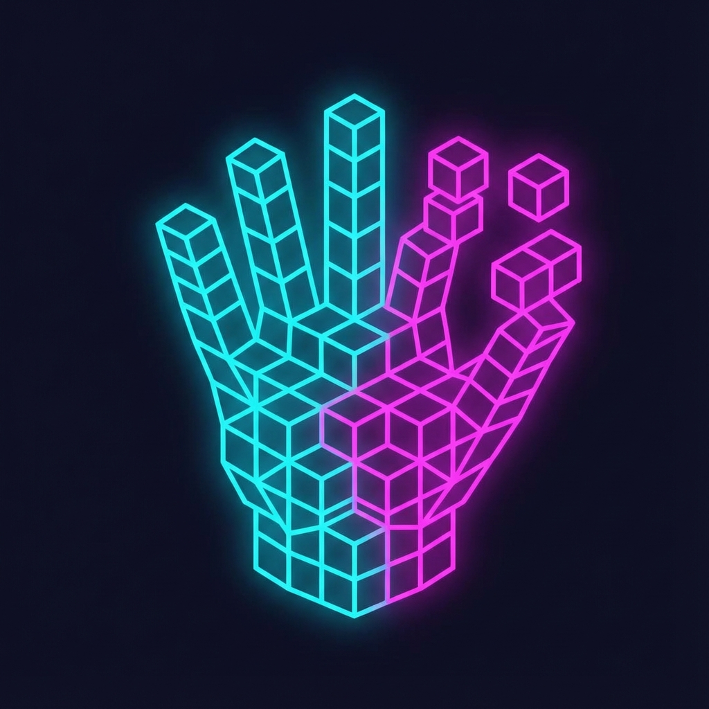

# GestureForge

<p align="center">
  
</p>

**Forge 3D creations with your hands.** Hand-tracking voxel painter with AI 3D Genesis — draw in AR, generate solid 3D shapes with gestures.

---

## 🚀 Quick Start

### 1. Prerequisites
- **Python 3.10+** (recommended: [Miniconda](https://docs.conda.io/en/latest/miniconda.html))
- **Webcam** (for hand tracking)
- **Windows/Linux/Mac** with OpenGL support

### 2. Clone & Install

```bash
# Clone the repository
git clone https://github.com/YOUR_USERNAME/GestureForge.git
cd GestureForge

# Install dependencies
pip install -r requirements.txt
```

### 3. Download Hand Model (First Run Only)

The MediaPipe hand model (`hand_landmarker.task`) should be auto-downloaded on first run, or manually:

```bash
python -c "import mediapipe as mp; mp.solutions.hands.Hands()"
```

### 4. Run

```bash
python main.py
```

> **Note:** If you see "can't open file", make sure you `cd` into the project folder first!

---

## ✨ Features

| Feature | Description |
|---------|-------------|
| 🎨 **Hand Tracking** | Draw voxels with pinch gestures |
| 🌐 **Infinite Canvas** | Pan/zoom with left hand |
| 🧊 **AI 3D Genesis** | Transform drawings into solid 3D (2500 particles) |
| 🔄 **Grab & Spin** | Physics-based rotation with inertia |
| 📐 **Two-Hand Scale** | Squeeze both hands to grow model |
| 🔁 **Auto-Spin** | Model rotates slowly when idle |
| 📹 **Recording Mode** | Export demos as MP4 |

---

## 🎮 Controls

### Hand Gestures

| Hand | Gesture | Action |
|------|---------|--------|
| Right | Index Pinch | Draw |
| Right | Middle Pinch | Erase |
| Left | Index Pinch + Drag | Pan / Rotate 3D |
| Left | Pinky Pinch + Drag | Zoom |
| Left | Ring Pinch | Cycle colors |
| Left | Wave | Clear canvas |
| Both | Squeeze together | **Generate 3D** or **Scale** |

### Keyboard Shortcuts

| Key | Action |
|-----|--------|
| **G** | Generate 3D |
| **C** | Clear Genesis / Reset |
| **R** | Toggle Recording |
| **S** | Save world |
| **L** | Load world |
| **Space** | Clear canvas |
| **Esc** | Quit |

---

## 🧊 AI 3D Genesis Workflow

1. **Draw** any shape with right hand pinch
2. **Squeeze both hands** (pinch with both) → 3D morphs!
3. Wait for particles to solidify (2500 particles)
4. **Grab & spin** with left hand pinch
5. **Release** → Model continues spinning (inertia)
6. **Squeeze again** (in VIEWING mode) → Model **scales up**!
7. Press **C** to reset and draw again

---

## 🛠️ Tech Stack

- **Python 3.10+**
- **PyOpenGL** — Hardware-accelerated 3D rendering
- **MediaPipe** — Real-time hand tracking
- **Pygame** — Window management & input
- **NumPy** — Fast vector math
- **OpenCV** — Camera capture

---

## 📋 Requirements

```
mediapipe>=0.10.0
opencv-python>=4.8.0
pygame>=2.5.0
numpy>=1.24.0
PyOpenGL>=3.1.6
PyOpenGL-accelerate>=3.1.6
```

---

## 🐛 Troubleshooting

| Problem | Solution |
|---------|----------|
| "can't open file 'main.py'" | Run `cd GestureForge` first |
| "No module named 'mediapipe'" | Run `pip install -r requirements.txt` |
| Black screen / No camera | Check webcam permissions |
| Low FPS | Close other camera apps, reduce window size |

---

## 📄 License

MIT
